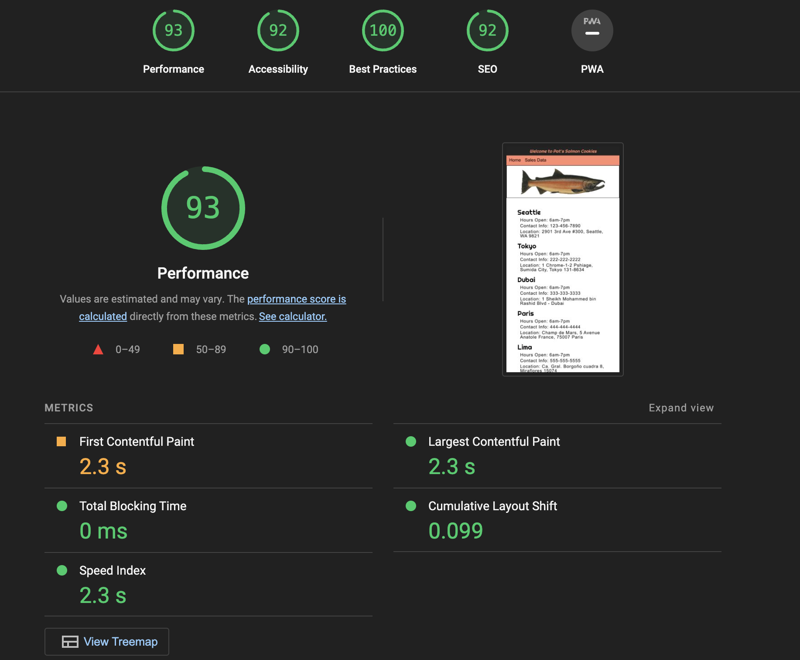
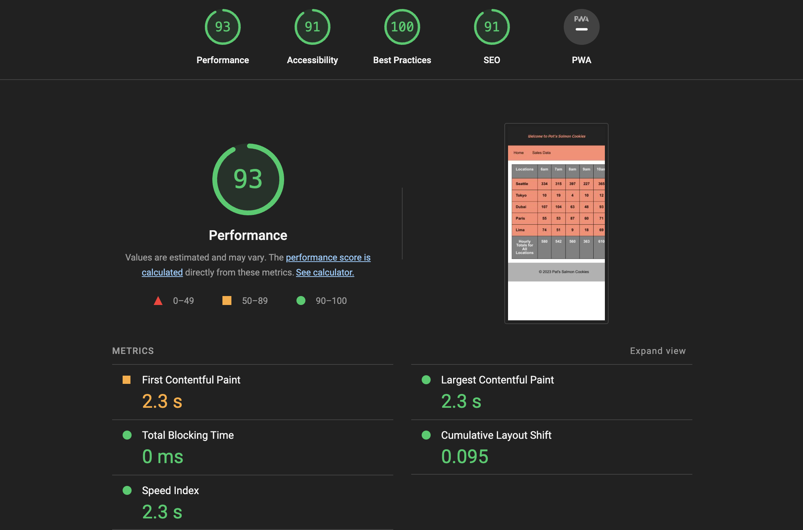

# cookie-stand

## Module 2 Lab

### 26 Feb 2024 | Monday

Establish js functions, html for index and data pages, and css for styling.

Lighthouse Score for Lab-001:

### 27 Feb 2024 | Tuesday  

Establish js functions to cookie-stand table data. Added CSS to target selectors and specific portions of the table.  

Lighthouse Score for Lab-002:

  
  
### 28 Feb 2024 | Wednesday  

Made changes to CSS in the sales css in order to target specific sections of the table. Also revised the css in both index and sales to organize properties and develop consistency across sizing use (rems).

  
